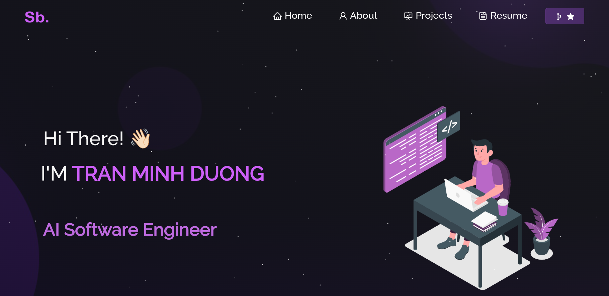

  

# Hi, I am Tran Minh Duong or *tmd* for short !

## About Me

- **Location:** Hanoi, Vietnam
- **Passion:** Crafting cool solutions, building machine learning models, and exploring new tech challenges.
- **Fun Fact:** When I'm not coding, you might find me solving real-life puzzles or just enjoying a good cup of Vietnamese coffee.

## 🔭 Pinned Projects

Here are a few projects I’m proud of:

- **[elemat](https://github.com/tmdeptrai/elemat)**: A project that demonstrates my knack for web and app development.
- **[FireDetectionSystem](https://github.com/tmdeptrai/FireDetectionSystem)**: Using technology to help keep communities safe.
- **[LeNet-5_CNN](https://github.com/tmdeptrai/LeNet-5_CNN)**: My venture into deep learning and computer vision.
- **[MachineLearning](https://github.com/tmdeptrai/MachineLearning)**: Experimenting with algorithms and data science techniques.

## 🎯 What I’m Working On

- Enhancing my machine learning models.
- Exploring new trends in AI and automation.
- Collaborating on open-source projects that challenge the status quo.

## 📫 How to Reach Me

- **GitHub:** [tmdeptrai](https://github.com/tmdeptrai)
- **Facebook:** [duong.tranminhahaha](https://www.facebook.com/tran.minhduongovtk)
- **Email:** duongtm.23bi14126@usth.edu.vn or minhduongqo@gmail.com

## 🤝 Let’s Collaborate!

I’m always on the lookout for innovative projects and collaborations. If you have an idea or just want to connect, don’t hesitate to reach out.

---

*“Code is like humor. When you have to explain it, it’s bad.”*  
— Cory House

Happy coding and have a fantastic day! :D
